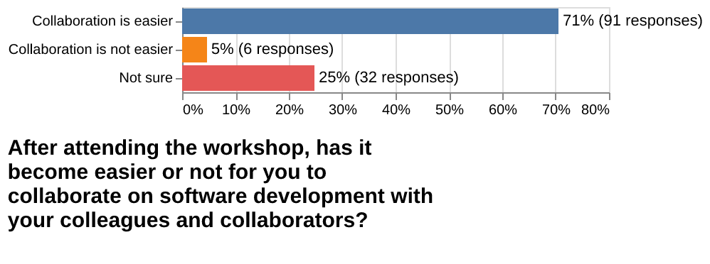
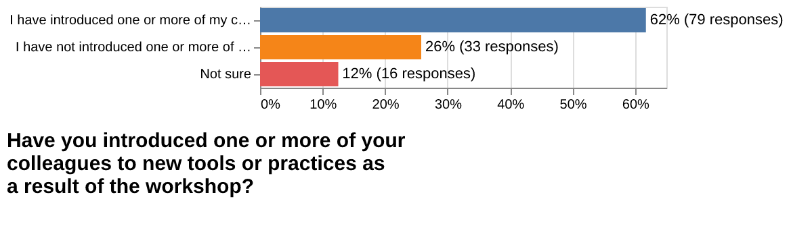
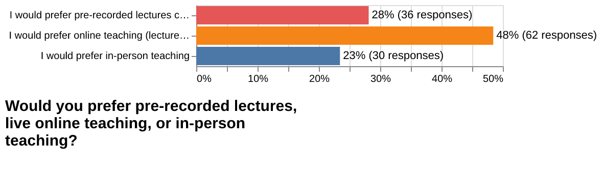
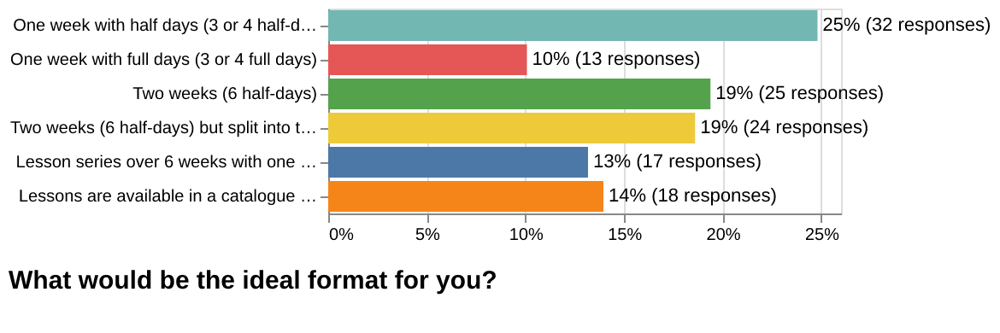
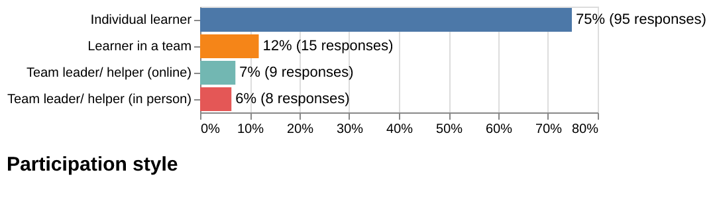
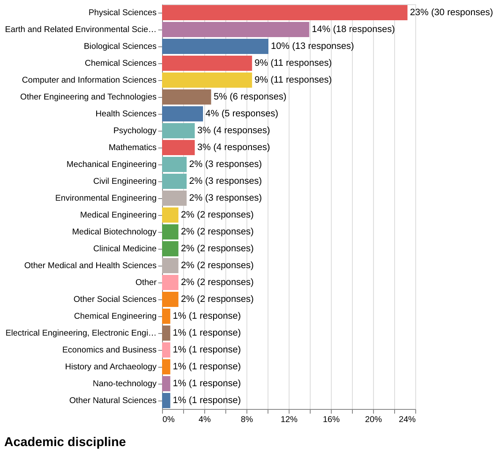

# 2024-post-workshop-survey

Post workshop survey sent out to workshop participants from 2022 and 2023.

- Number of delivered submissions: 129
- Survey was open from 2024-02-14 to 2024-04-23
- [Questions](form.pdf)

## Notebook

## Plots

## Alt-text for plots

In your estimate, how much time per month have you saved as a result of attending a CodeRefinery workshop?
- No time saved: 20 responses
- Minutes: 32 responses
- Hours: 59 responses
- Days: 17 responses

After attending the workshop, would you judge your code to be more reusable or not more reusable?
- My code is more reusable: 90 responses
- My code is not more reusable: 9 responses
- Not sure: 30 responses

After attending the workshop, has it become easier or not for you to collaborate on software development with your colleagues and collaborators?
- Collaboration is easier: 91 responses
- Collaboration is not easier: 6 responses
- Not sure: 32 responses

Have you introduced one or more of your colleagues to new tools or practices as a result of the workshop?
- I have introduced one or more of my colleagues to new tools or practices: 79 responses
- I have not introduced one or more of my colleagues to new tools or practices: 33 responses
- Not sure: 16 responses

How likely is it that you would recommend CodeRefinery workshop to a friend or colleague?
- 10: 64 responses
- 9: 21 responses
- 8: 24 responses
- 7: 11 responses
- 6: 3 responses
- 5: 1 responses
- 4: 1 responses
- 3: 3 responses
- 0: 1 responses

Would you prefer pre-recorded lectures, live online teaching, or in-person teaching?
- I would prefer pre-recorded lectures combined with live discussions: 36 responses
- I would prefer online teaching (lectures are live): 62 responses
- I would prefer in-person teaching: 30 responses

What would be the ideal format for you?
- One week with half days (3 or 4 half-days): 32 responses
- One week with full days (3 or 4 full days): 13 responses
- Two weeks (6 half-days): 25 responses
- Two weeks (6 half-days) but split into two separate logical courses: 24 responses
- Lesson series over 6 weeks with one session per week: 17 responses
- Lessons are available in a catalogue of videos and can be followed anytime: 18 responses

Participation style
- Individual learner: 95 responses
- Learner in a team: 15 responses
- Team leader/ helper (online): 9 responses
- Team leader/ helper (in person): 8 responses

Career stage
- Undergraduate student: 3 responses
- Graduate student/ PhD student: 63 responses
- Postdoc: 18 responses
- Researcher: 19 responses
- Professor: 4 responses
- Research software engineer/ Scientific programmer: 12 responses
- Industry: 4 responses
- Other: 6 responses

Academic discipline
- Physical Sciences: 30 responses
- Earth and Related Environmental Sciences: 18 responses
- Biological Sciences: 13 responses
- Chemical Sciences: 11 responses
- Computer and Information Sciences: 11 responses
- Other Engineering and Technologies: 6 responses
- Health Sciences: 5 responses
- Psychology: 4 responses
- Mathematics: 4 responses
- Mechanical Engineering: 3 responses
- Civil Engineering: 3 responses
- Environmental Engineering: 3 responses
- Medical Engineering: 2 responses
- Medical Biotechnology: 2 responses
- Clinical Medicine: 2 responses
- Other Medical and Health Sciences: 2 responses
- Other: 2 responses
- Other Social Sciences: 2 responses
- Chemical Engineering: 1 responses
- Electrical Engineering, Electronic Engineering, Information Engineering: 1 responses
- Economics and Business: 1 responses
- History and Archaeology: 1 responses
- Nano-technology: 1 responses
- Other Natural Sciences: 1 responses

## Free-form answers

### Has anything else changed in how you write code for your research after attending the workshop?

- I started doing documentation in Read the Docs and it really makes the
  difference. Thank you!

- Usage of documentation with sphinx to pages planned, not done for now.

- I learned to use Git and GitHub.

- Optimized coding.

- Modularity, smaller functions.

- I use Git extensively since attending the workshop.

- GitHub, Bash, Python, and others were very useful even if many things I did
  already know in advance.

- Especially code documentation improved a lot as a consequence of the course.

- I use Git for myself and it is nice, but I think so much depends on your
  supervisors, so ... there is little leverage for me to change things.

- When I don't know how to do something, I use your lesson material as a
  reference.

- I think I am a lot more confident when writing code now.

- I write my code so that it is more easier to read by others.

- I write more cleaner code, I think. I have a better understanding of testing
  routines, though haven't incorporated them yet myself.

- Commenting and code structure.

- My code is more streamlined and elegant when it comes to reproducibility.

- More comments, splitting files in separate notebooks, etc.

- Learned to use Git and GitHub better.

- I have changed some of my earlier code to be more "modular", that it is easier
  and quicker to run. At least that. Workshop has also made some changes in how I
  think about coding, that will probably show in my future work. So, the workshop
  felt very useful.

- Give more emphasis to code structure (architecture) and adopting a consistent
  way of writing code.

- I have gotten better at using functions in code, previously it was much more
  script-esque. I have referred several junior colleagues to your workshops as
  well (and they've also found them valuable).

- I try to be tidier but it is hard.

- Started using Git.

- I have improved my reusability and documentation of my codes.

- I thank my past self for writing such clear codes now.

- Considering the latest workshop, the most important topic for me is the "How
  to document your research software". After the workshop, I have used "GitHub
  Pages" and "GitHub Actions" for the main documentation of the project that I
  am currently working on.

- I document my code more thoroughly.

- I didn't know how to use git version control before. Now I find it so useful!

- Better documentation + Easier to test.

- I have started writing more modular code and I use git more diligently, too.

- I use Git in much more sophisticated way and enjoy it!

- I think more on the potential reader of my code and make it more comprehensible.

- It is hard to tell, since I took CodeRefinery in the beginning in my PhD. I
  think the focus on tests and test-driven development has had a good impact on
  my coding.

- The most important outcome I got from CodeRefinery was learning version control.

- I am way more careful to commit regularly to my repositories and keep track of changes better.

- No. But I am mainly an experimental scientist. Coding isn't a big part of my work.

- I use Git more consistently and I learned that making my code more easily
  understandable does not in fact cost me as much more time as it saves. I have
  known that I have room to grow for a long time, but would like to mention
  that just the fact that I finally made time for the workshop and I focused on
  developing my coding for a few days helped as well.

- I try to write more functions to reuse code for multiple purposes.
  Furthermore, I've started using virtual engines.

- Haven't coded a lot since then so hard to say.

- I write self explanatory commit messages.

- I back up in git repositories almost all my code.

- I try to document my code as I am writing it.

- I am just starting to apply the information from "HPC Best Practices." From
  previous workshops, it has been a useful reference point to discuss
  collaborative workflow with colleagues.

- My code was always a mess that was meant to be solely my personal playground.
  The workshop definitely changed my mindset about it - now I think in the
  process of what is the best way to write the code (and comment it) so it can
  be used by other people without any (or at least, big) difficulties. I don't
  use Git actively at the moment, but it was great to receive the necessary
  toolkit for efficiently working with it. I think I will definitely need it at
  some point!

- I've been trying to use Git for all of my projects.

- A lot has changed on the way how I run code and test it. I attended code
  refinery while I was still new to programming so it was difficult to put into
  use the learning from code refinery. Now that I actually do coding for my
  research, I expect to make the most of the workshop.

- I am using Snakemake now. Right now I think it might not speed up my work
  because I am still learning, but I think the benefits will come over time.

- Making my codes easier to share, comment them and version control.

- It maybe not directly related to the code itself but I've learned a lot of new
  what is always very beneficial in this area.

- Slightly. I was aware of much already in the course.

- I don't have a lot of versions of my code anymore. I have my codes in a Git
  repository that can be shared with my publications.

- I can write code more compactly and with high performance.

- I tend to write more functions with documentation and test units.

- More testing and better documentation.

- I try to create new Git branch for every new line of development to always
  have a working version of the code.

- I haven't been writing a lot of code since the workshop so I haven't really
  had a chance to put everything into practice, but I'm trying to create a
  project environment for each project and I have been documenting my working
  process in RMarkdown notebooks. The notebooks have been really helpful for my
  research process.

- I am trying to keep good practices in mind. I am trying to use proper workflows
  (raise issue ==> create branch ==> deploy fix ==> push ==> merge request), etc.

- Not after this workshop just when I tried it in my own projects.

- I use more arrays, which speeds up my work a lot.

- I try to use GitHub now. try to do at least some version control.

- Better commenting.

- It has been easier to get to know other's code projects because I have
  learned some of the conventions eg. in naming.

- Now I use Git for managing the code folders.

- I tried to follow the rules to make it more reusable.

- I am more organised thanks to the use of Git.

- No.

- More focus on version control and testing.

- My code is still so bad that I haven't benefited from it yet. But I am
  definitely going to integrate it. Actually, thanks for asking, I will just
  get a few words of advice from my colleague on how best to apply what I
  learned at your workshop! :)

- Made life easier when I work with git tool.

- For me trying to write more readable and reusable code is taking a bit more
  time at the moment, but that is because I do not write code very much so I
  take a lot of time planning the code and the parts and how they are most
  fluently glued together. So I expect it to become easier and take less time
  with practice.

- I'm actively trying to use Git, and back-up my projects (code, useful
  articles) in my personal GitHub. I try to update it and, though I've not done
  so yet, I intend to use tags to keep track of milestones along the project.

- I started using Git on all my projects.

- I started using renv to track which version of packages I am using.

- Forcing myself to write function description prior to actually writing the function.

- Creating all code under Git control.

- Trying more modular approaches.

- I think my code now is modular. The way I organize my repositories reflects
  it too.

### What topic(s) should we add to our workshops?

[Answers like "None", "Nothing", "Everything was on point", etc., are not shown
in the results below.]

- More advanced topics on GitLab.

- Hands-on with setting up, training and running AI-models.

- Java APIs.

- Java for beginners.

- Automation with Azure.

- OOP with Python.

- Xarray and/or similar useful libraries

- Some stuff related to Quantum Computing could be quite interesting. Also some
  more "technical computer skills" (how its works by inside, compilations..)
  could be interesting.

- It would be good if in the workshop you also showed how to connect GIT to a
  private repository on GitHub and later how to synchronize such a connection
  with VS Code or RStudio.

- I have not managed, unfortunately, to make git a regular part of my workflow.
  For that, I find that a short revision few weeks after the course would be
  useful.

- Linting/debugging and maybe more time for testing.

- Besa training.

- Matlab training.

- Python training.

- Visualisation with Python, Matplotlib of gridded data (thinking about maps,
  projections). And also setting up figures with multiple plots. Smart ways to
  get reusable code for creating figures.

- Processing of non-linear timestamp data; Combination of float, string, object data in the same data analysis.

- The actual pieces of code shown were minimal and went quite fast whereas
  there was a lot of discussion in very general analogy level which wasn't so
  helpful.

- Could mention VSCode's version control instead of just using the terminal.

- Git (always useful).

- Python: managing problem with installation packages.

- Python: debug (within some environment: Spyder (?).

- How to use Google Colab.

- Maybe: Docker / code ocean ...

- Maybe more on organizing "analysis script" type projects - at least where I
  am this is a more common than developing software packages.

- I think the program was good, but the Git part was most useful.

- I think the current topics are very good. I felt like the course was a nice
  introduction to all the topics, even for the length of it it felt a bit
  crowded, so I think it is good as it is.

- VS Code and GitHub Copilot or using AI for coding.

- I know that GitLab Pages and GitLab CI have similar workflows but you might
  also consider creating some examples for those alternatives as well.

- Maybe something about reproducibility (like Docker containers etc.) or code
  publications beyond Zenodo.

- A small note on how to correctly version-control Jupyter notebooks would be
  useful.

- It would have been nice to spend a couple of minutes on GitHub Desktop (not
  all of us are Terminal fans).

- Build systems: For example Make or CMake.

- HPC: What are supercomputers and how to use them. What are GPUs, how to program and use them.

- Object Orient Programming (for Python).

- Use of AI tools for coding.

- Perhaps package building for Python? Or a practical example of Docker
  application? But this is more for a subsequent workshop, I would not remove
  anything from the workshop as I attended it.

- Go further on how to browse some else's code.

- Further on recovery options of erroneous commits.

- A bit on debugging.

- More than additional topics, interactive/exercise segments should be added
  after topics to reinforce learning. This was more the case in earlier workshops
  than the day 1 HPC best practices workshop.

- In terms of content covered, although challenging, more concrete examples on
  how to find the right amount of memory and CPUs to allocate a job would be
  incredibly valuable.

- For the general CodeRefinery workshop, I think a "putting it all together"
  unit, including hands-on exercises, would be incredibly helpful, and almost
  essential, to see the extent of a baseline application of the knowledge
  included.

- Since Visual Studio code is quite popular editor it would be good to teach
  running Jupyter notebooks in Visual Studio Code.

- The courses are very complete, perhaps something about dataset sharing.

- ML maybe =)

- Something about docker maybe? It's used more and more in my experience.

- Perhaps a couple of more advances focused workshops of advances git to save
  time and make it easier to manage code and collaborating.

- Code for publishing.

- PEP 8 style.

- Maybe for more advanced courses: Object based coding.

- Functionalizing a code.

- I think it is just right. Adding more may be too overwhelming for a beginner.

- Testing.

- Refactoring.

- Management in general (partly done already).

- I would have liked to spend more time on reproducible environments.

- Difficult to know. I recently would have benefited from knowing more about
  (c)cmake, but this becomes very specific. Git is likely the one thing that
  has most general applicability from your education suite.

- More focus on writing statistical code (as opposed to software).

- The topics look fine the overall organization of the workshop was a limiting
  factor. There were too many participants and it got chaotic due to the
  limited number of teachers. Maybe CodeRefinery should focus on quality rather
  than on quantity, for instance deliver courses with reduced number of
  participants on-line. Also, CodeRefinery can coordinate with universities
  where local instructors could teach the courses locally.

- Conda environments.

- Using pycharm for some code development and version control.

- More testing and how to switch from chaotic version control to a good one.
  Now there is only from scratch, but it would be helpful to go over from
  midpoint.

- How to use Chatgpt to assist coding.

- Using a IDE for Python programming: Notebook & Git/Github integration, debugging, etc.

- Docker or containerization in general.

- How about software design for research? How to write reusable and
  maintainable code when you don't know today what you need tomorrow, or when
  students, who may have been sole authors, move on.

- More examples of Pull requests, forks and upstream repositories or local
  repositories.

- More advanced topics on git collaboration.

- Since I work with R I would have liked to get more R specific information.
  But I can see how it can be difficult to add specific info if everyone uses a
  different language.

- Conda vs mamba, module management?

- Code architecture and data repository architecture and management.

### What topic(s) should we remove?

[Answers like "None", "Nothing", "Everything was on point", "All the topics are
relevant", etc., are not shown in the results below.]

- The course is very good as it is ...
  However, The 6 half days over 2 consecutive weeks  is not very convenient for some people here ...
  However, I understand the difficulty to bring together online helpers and instructors.
  You are doing a good job ! Keep going !

- Reproducible research and social coding are a little vague for my taste. So if you need more time, I'd skip them.

- Jupyter

- The Open Science workshop day has a lot of potential, but there is too little
  time with too few interactions with too many topics to make a difference. The
  exercises are not very engaging and you did not go deep enough in the aspects
  you try to cover.

- Jupyter notebook, because Python is too slow.

- I attended the workshop about Git and was surprised that also other topics
  were covered. Maybe have shorter, more focused courses instead of the current
  format.

- In the first workshop I attended, the general code refinery workshop, I did
  not get enough of a grasp on Snakemake, and other tools I understood well
  mainly because of prior experience. I think this was a wonderful workshop
  that I have repeatedly recommended to my colleagues, but I think more time
  should be given to fully try out and cement each tool introduced. I would
  roughly add 50-100% more time to the course and spend all the added time on
  more live exercise walk-through and coaching while people work on exercises
  individually. I would not remove any topics.

- I found the basic Git introduction to be rather tedious, so I lost my focus
  and motivation. This made it difficult to prioritize attending the final
  parts of the workshop over other duties, so I eventually opted out
  completely.

- I would much prefer an approach were participants are assumed to be at a
  somewhat competent level from the get-go. Preparation material could be
  provided ahead of time for the beginners.

- Maybe automated testing and modular coding to put that in a separate workshop about improving coding practices.

- Documentation was a lot of things in a very short time. I say just choose one
  of the documentation options to explain.

- None of them. Or split the topic of collaborative programming (Day 1 to 3)
  and documentation (Day 4 to 6) to two separate courses.

- I don't think anything should be removed...maybe a second workshop that goes into more depth on reproducibility?

- How about you ask registrants to pick their three/five/x favorite topics from
  a list upon registration, and you select the N most popular ones? Perhaps
  makes it more difficult to prepare, and perhaps makes it more difficult for
  participants to commit, but since participation (at least online) is a
  relatively low commitment, maybe it is okay anyway?

- Maybe a small practice session for some of the presenters - a few of the
  presenters could improve their communication skills. I know it is a small
  thing, but just adding 10-20% humor or more energy into a presentation can
  really significantly affect the learning output for students.

- For me personally the Jupyter notebooks session was less helpful. But that
  doesn't mean it should necessarily be removed.

### Other feedback

- Let me highlight it here: your format is great!
  The features I liked in particular:
  - HackMD and very high quality feedback there
  - type-along sessions
  - dialogue between the two teachers as a format of the lecture.
  Many thanks for your effort!

- It was great that I could watch the few sessions that O unfortunately couldn't attend on video.

- Thanks a lot for organizing these super useful workshops
  and for promoting/creating a environment very relaxed and inclusive
  learning environment.
