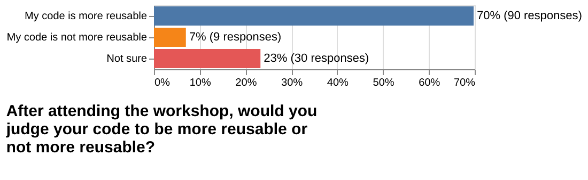

# 2024-post-workshop-survey

Post workshop survey sent out to workshop participants from 2022 and 2023.

- Number of delivered submissions: 129
- Survey was open from 2024-02-14 to 2024-04-23
- [Questions](form.pdf)

## Notebook

## Plots

